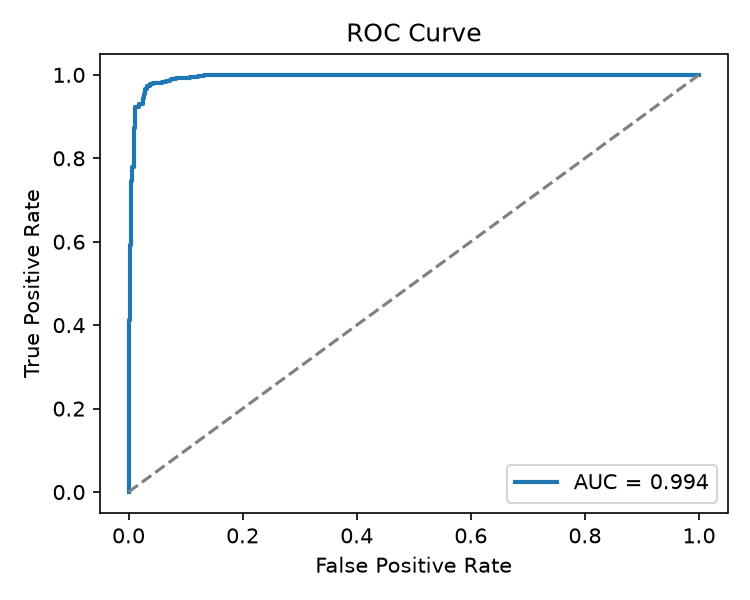
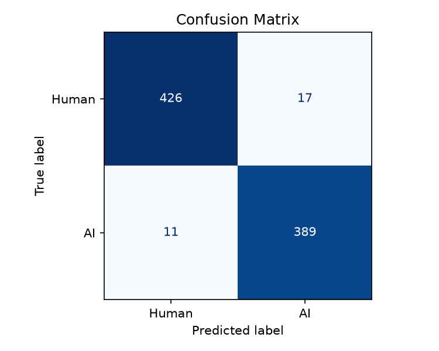
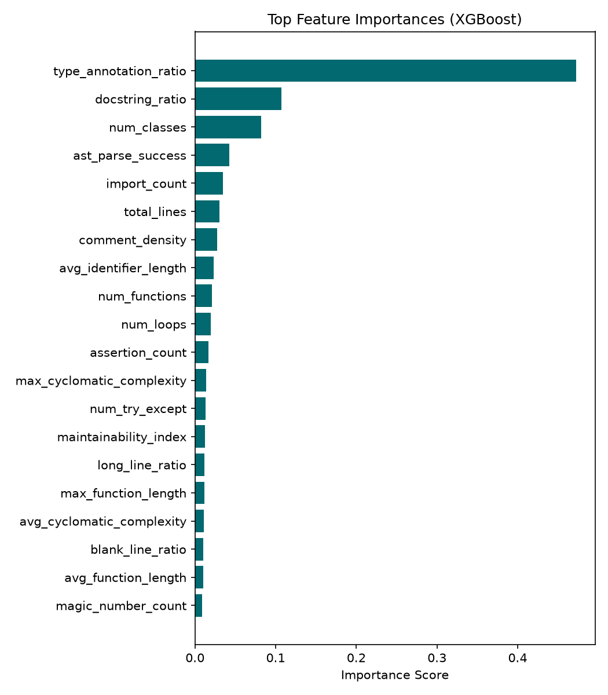
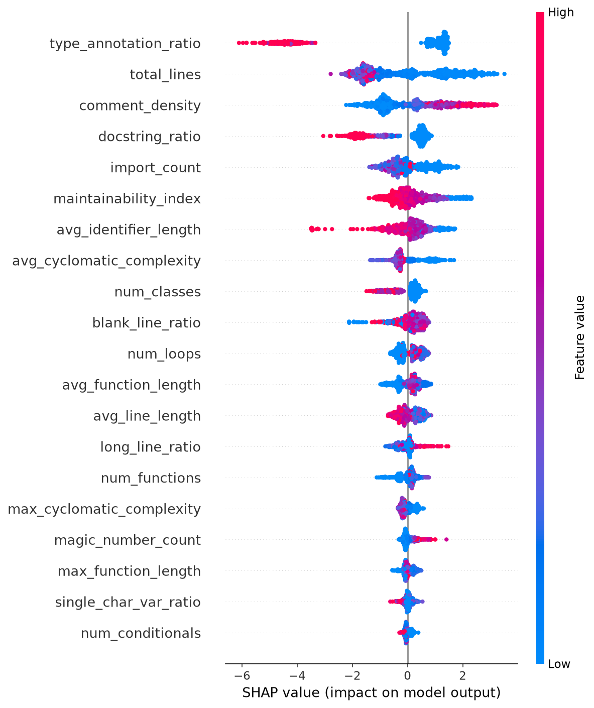

# CodeSense

**Explainable AI-assisted code authorship analysis.**

CodeSense detects whether Python source code was written by a human or generated by AI. It uses 24 hand-crafted static-analysis features — structural patterns, naming conventions, complexity metrics, and documentation signals — fed into an XGBoost classifier. No code is ever sent to an LLM API.

[](https://github.com/Samearth17/Codesense/actions)

## Results

| Metric | Value |
|---|---|
| **Test AUC** | 0.9939 |
| **CV AUC (mean ± std)** | 0.9940 ± 0.0022 |
| **Features** | 24 |
| **Training samples** | 3,372 |
| **Test samples** | 843 |

<details>
<summary>📊 Model evaluation plots</summary>

### ROC Curve


### Confusion Matrix


### Feature Importance


### SHAP Summary


</details>

## How It Works

1. **Paste code** — drop a Python file or snippet into the analysis page.
2. **Feature extraction** — CodeSense extracts 24 metrics using AST parsing and [Radon](https://radon.readthedocs.io/) complexity analysis:
   - Docstring ratio, type-annotation ratio, naming patterns
   - Cyclomatic complexity, maintainability index
   - Structural counts (functions, classes, loops, try/except)
   - Formatting signals (blank lines, line length, comment density)
3. **Classification** — An XGBoost model scores the feature vector and returns a probability estimate.
4. **Explainable output** — The response includes the top contributing signals and a full feature breakdown, so results are auditable rather than opaque.

## Tech Stack

| Layer | Technology |
|---|---|
| **Frontend** | Next.js 15, TypeScript, Tailwind CSS, Framer Motion |
| **Backend** | FastAPI, Pydantic, Structlog |
| **ML** | XGBoost, Radon, SHAP, scikit-learn |
| **CI** | GitHub Actions (lint + test) |
| **Deployment** | Vercel (frontend) + Render (backend) |

## Repository Layout

```text
codesense/
├── frontend/          # Next.js 15 App Router UI
│   ├── app/(app)/scan # Code analysis page
│   └── components/    # Design system (Badge, MetricCard, etc.)
├── backend/           # FastAPI service
│   └── app/api/       # /scan endpoint, dependencies, schemas
├── ml/                # Independent ML module
│   ├── feature_extractors/  # 24-feature static analysis
│   ├── inference/           # Predictor + FastAPI wrapper
│   ├── training/            # Model training pipeline
│   ├── models/              # Trained XGBoost model (874 KB)
│   └── plots/               # ROC, SHAP, confusion matrix, importance
├── datasets/          # Dataset builder pipeline
├── scripts/           # Automation entry points
├── tests/             # Cross-service tests
├── docker/            # Docker support files
└── .github/           # CI workflows
```

## Quick Start

### Prerequisites

- Python 3.12+, [uv](https://docs.astral.sh/uv/)
- Node.js 22+

### Local Development

```bash
# Clone
git clone https://github.com/Samearth17/Codesense.git
cd Codesense

# Backend
cp backend/.env.example backend/.env
cd backend
uv sync
uv run fastapi dev app/main.py
# → API at http://localhost:8000

# Frontend (new terminal)
cp frontend/.env.example frontend/.env.local
cd frontend
npm install
npm run dev
# → UI at http://localhost:3000
```

Navigate to [localhost:3000/scan](http://localhost:3000/scan), paste Python code, and click **Analyze**.

### Docker Compose

```bash
docker compose up --build
```

## API

### `POST /api/v1/scan`

```json
{
  "code": "def hello(): ...",
  "filename": "example.py"
}
```

**Response:**

```json
{
  "label": "ai",
  "confidence": 0.87,
  "is_ai": true,
  "top_signals": ["docstring_ratio", "type_annotation_ratio", "maintainability_index"],
  "features": {
    "docstring_ratio": 1.0,
    "type_annotation_ratio": 1.0,
    "maintainability_index": 82.5,
    "avg_identifier_length": 9.3,
    "single_char_var_ratio": 0.02,
    "comment_density": 0.15,
    "blank_line_ratio": 0.18,
    "avg_cyclomatic_complexity": 2.4
  },
  "filename": "example.py"
}
```

### `GET /health`

Returns `{"status": "ok", "service": "codesense-backend"}`.

## Technical Decisions

- **XGBoost over deep learning** — With 24 engineered features and ~4K samples, a gradient-boosted tree outperforms neural approaches and trains in seconds. The model file is 874 KB (vs. hundreds of MB for transformers).
- **Static analysis only** — All features are extracted deterministically from the AST and Radon metrics. No LLM calls, no network dependencies, no privacy concerns.
- **Explainability first** — SHAP values and top-signal reporting ensure every prediction is auditable. This is a design constraint, not an afterthought.
- **Monorepo with independent ML** — The `ml/` package has its own `pyproject.toml` and can be developed independently of the web stack. The backend imports the predictor at runtime.

## Quality Gates

- **Frontend**: ESLint, Prettier, TypeScript strict mode
- **Backend**: Ruff, Pytest, Python 3.12 via uv
- **CI**: GitHub Actions on every push and PR

## License

MIT
